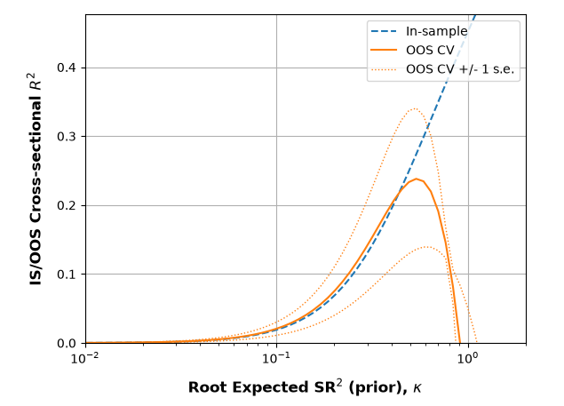
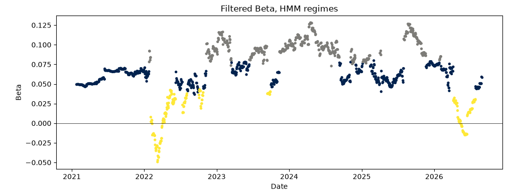

[README.md](https://github.com/user-attachments/files/31417438/README.md)
## Shrinking the Cross-Section (SCS) Factor Model

The SCS notebook implements the L2-shrinkage (ridge-type) estimator from **Kozak, Nagel, and Santosh (2019), "Shrinking the Cross-Section"**, which estimates a stochastic discount factor (SDF) as a regularized combination of a large set of candidate return factors rather than relying on a small hand-picked set.

The method works by:

- De-marketing excess returns
- Estimating SDF coefficients across a grid of shrinkage (L2 penalty / kappa) values
- Selecting the optimal shrinkage level via k-fold cross-validation (maximizing out-of-sample cross-sectional R²)
- Producing diagnostic plots (coefficient paths, t-statistics, degrees of freedom, and CV objective curves) and a summary table of the largest/most significant coefficients

The data used here are **Goldman Sachs factor portfolios**, applied as the set of candidate anomaly/factor returns fed into the shrinkage estimation. Since these GS portfolios are **updated daily**, the model can be re-estimated on a rolling basis with fresh data, giving it genuine real-world applicability.

## Kalman Filter Regime-Switching UIP Model

The Kalman notebook implements a **time-varying linear regression via a Kalman filter** to estimate the relationship between EUR/USD returns and the EUR–USD interest rate differential, testing the classical **Uncovered Interest Rate Parity (UIP)** hypothesis in a setting where the sensitivity between the two is allowed to drift over time rather than being estimated once, in-sample, and held fixed.

The method works by:
- Framing the regression as a linear-Gaussian state-space model, with the regression coefficients (alpha, beta) as a hidden state that follows a random walk
- Estimating the initial state via OLS, then calibrating the process and measurement noise via Maximum Likelihood Estimation (cross-checked with walk-forward cross-validation)
- Running the Kalman filter on a held-out test window to produce a day-by-day filtered beta, compared against a naive rolling-OLS beta via lead-lag cross-correlation
- Clustering the filtered beta into persistent low/medium/high-sensitivity regimes using a Gaussian Hidden Markov Model, and characterizing each regime's return distribution and annualized performance

The data used here are **daily USD and EUR 3-month OIS swap rates and the EUR/USD exchange rate**.

| Metric                 | Low    | Medium | High  |
|------------------------|--------|--------|-------|
| Days in regime         | 215    | 734    | 512   |
| Annualized mean return | -6.05% | -2.07% | 3.14% |
| Annualized volatility  | 7.89%  | 7.37%  | 7.00% |

